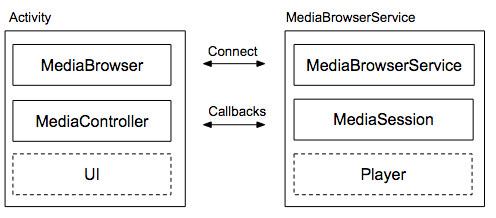
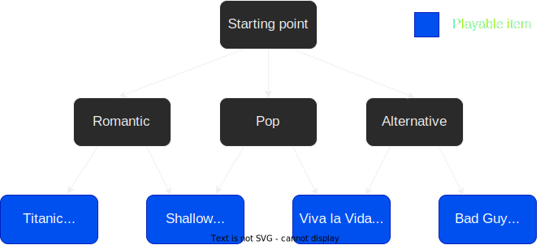
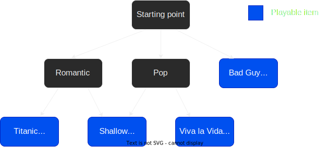
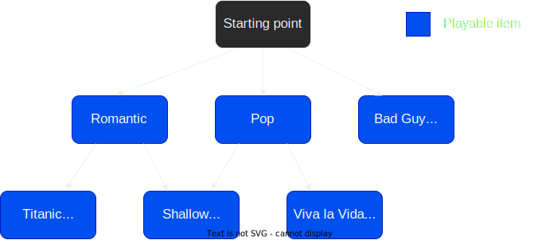
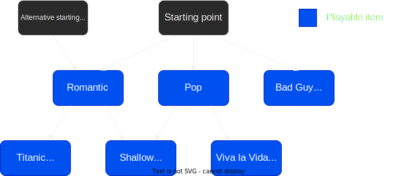
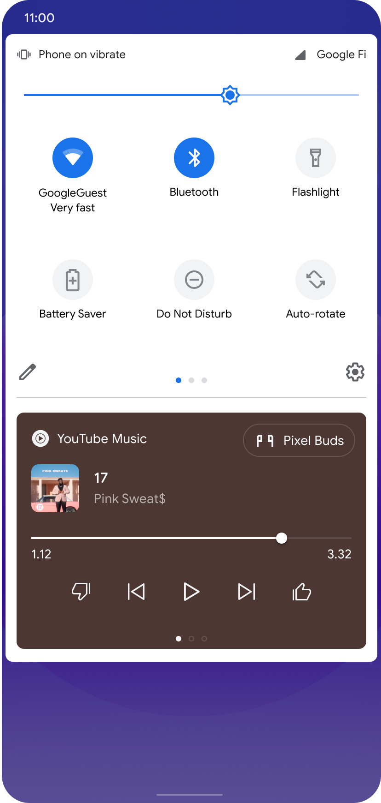

# Simple Music App

Educational Android app that demonstrates how to implement a complete, fully
fledged architecture for a small music player using the Android Media APIs.

The music player is silent: it's just a thread that sleeps for the duration of
the song entity it was instructed to play. This is because I want the focus to
be on the app's architecture.

This repository can be considered as a practical Android "Hello World" app for
music players. It's much simpler than the
[Universal Audio Media Player app](https://github.com/android/uamp) because it
doesn't use ExoPlayer and it strictly follows only what is described in the docs
(https://developer.android.com/guide/topics/media-apps/media-apps-overview). No
bells and whistles.

I am going to guide you, step by step, through the whole process of creating
this app from scratch. Every step is a commit in the repo's history. Please
follow along the commits in the history section of this repo as you read.

# Introduction

When thinking about implementing a music app, the most obvious component to
think of is the audio player. The **audio player** (or simply "player") is the
entity that's in charge of decoding/rendering/playing the audio media. A simple
audio player, for example, might have the ability to play audio files with
extensions `.wav` and `.mp3`.

However, in this documentation, we're not going to focus on implementing the
audio player. Instead, we're going to do two things:
  1. We're going to assume that the audio player is already implemented and it's
     callable through a certain API that it exposes.
  3. With this assumption in mind, we will focus on something more of a higher
     level: the music app's **architecture**, specifically for Android.

We don't need to know how the audio player is implemented to be able to define
and work on the architecture. We only need to have knowledge of its API so we're
able to call it. From the architecture's point of view, we only need to know how
to call the player's API so we can plug it in the right spots.

For the purposes of this documentation (which exclusively focuses on the music
app's architecture), we will assume that the player is already implemented and
exposes some reasonable API. This API might contain methods such as `play()`,
`pause()`, `skipToNext()`, and might also issue event callbacks such as
`onSongFinished()`.

# Splitting up the architecture

> Note before starting: some software development guides/tutorials normally
introduce code samples/snippets as they present concepts for you to follow along
and be working in your app's code as you read. Unfortunately, this isn't one of
those guides. The Android music app architecture is somewhat elaborate, and it's
difficult to even begin working on the app's code before having first a good
understading of all the elements the architecture consists of. So instead, I'll
first introduce these elements in an ordered, logical, and easy-to-follow way,
and once we have a full understanding of them, we can start working on the app's
implementation.

To understand the Android music app architecture, we first need to have in mind
the two most important expectations that a decent Android music-playing app must
fulfill:

  - **Expectation 1**: The app's music player should be controllable not only
    from the app's UI, but also from other places (aka **controllers**), such as:
      - the notification bar/lock screen (your app should provide a notification
        for the player)
      - external media hardware buttons
      - Google Assistant
      - Android Auto
      - Wear OS
      - other custom apps.
  - **Expectation 2**: The app should keep playing in the background even if the
    user minimizes it, switches to another app, or locks the screen. While it's
    on the background, the player should still remain controllable by the
    controllers listed above.
    
If you're knowledgeable in Android development, you'll probably realize that these
expectations strongly suggest that we need a client-server architecture for our
app. This is because:

  - A service is used to perform work in the background while the app is
    minimized. If our player lives inside a service, then this will fulfill the
    second expectation.
  - A client can connect and send commands to the service. If we consider clients
    to be the controllers listed in Expectation 1, then this fulfills said
    expectation.
    
If you're not knowledgeable in Android, or want a quick refresh, then read the next
section for more information about services. If you already know services, you
may skip the next section.

# Services

A service is an app component that has two features: 
  - It's able to perform work in the background without needing a UI activity to be
    visible.
  - It allows other contexts to bind to it (bind = connect to it) and to receive
    commands (messages) from such contexts.
    
How do you interact with a service in your app?

First, you need to be aware that a service is an instance of a subclass that extends
the abstract `Service` class, and that services are singletons. That is, given a
`Service` concrete subclass, there can only exist one instance of such subclass.

Just as with other app components (such as activities), Android is in charge of
managing the lifecycle/lifetime of this singleton service instance. For this reason,
you don't directly create, destroy, or handle a service instance yourself. Android
handles that for you. 


  - Start the instance of a given `Service` subclass: this makes a service start to
    perform the background work it's supposed to perform.
  - Bind a context to the instance of a given `Service` subclass: this causes the
    context to connect to the service so it's ready to start sending command to its.
 
Android then checks if the service instance already exists. If not, it creates it, and
then proceeds to start it or bind to it (depending on what you requested). The next time
you send a start or bind request, Android uses the already-existing instance.

If you 

From a context, you can *interact* with a service by doing any of the following:
  - Sending the start command to the service.
  - Binding to the service.

We say that a service is "interacted with" whenever a context does any of the
two bullet points just listed above.

The first time a service is interacted with, it is created. The next time an interaction
happens, Android re-uses the same interaction

In fact, music apps are such a very good, common, and practical examples where we
can use the client-server architecture that Android created two particular
classes for this scenario: the `MediaBrowser` (corresponding to the client)
and the `MediaBrowserService` (corresponding to the service).

This is how it will work:

  1. You associate a `MediaBrowser` instance to your activity. Th media browser
     instance will act as a client to your service.
  2. Upon app startup, the media browser binds to your service.
  3. 
app startup, will bind to your service `

client-service

To meet these expectations, we need to architect our app in 5 overall/general
steps, which I outline below. I'm gonna be explaining these 5 steps in the next
sections, so don't worry if they don't make sense in the first read.
  1. Wrap your player inside a **media session** (that is, abstract your player
     and put it behind a media session).
  2. Wrap the media session inside a **media browser service**.
  3. Define a notification associated to the media session
  4. Define access permissions to the media browser service.
  5. Organize your media content library and let the media browser service provide
     it.
  6. From your UI activity, connect to the media browser service
  4. Once your activity is connected to the service, create a
     **media controller** linked to the media session created in step 1.
  5. Finally, use the media controller to control (send commands to) the player.
     (Technically speaking, the media controller sends the commands to the media
     session, and the latter forwards the commands to the player).

# Step 1. Wrap your player inside a media session

The first expectation listed above states that the player should be controllable
from several **controlling places**, not only from your own app's UI. To achieve
this, we need to abstract the player from the rest of your app. That is, we need
to separate the player into a decoupled Android module that is callable from any
of the previously listed controlling places.

Hold on...didn't we do that already? Wasn't the initial assumption of this guide
that the player is already implemented and abstracted, and we just care about
its API?

Good question. To answer it, we need to clarify that there are two different
levels of abstractions:

  - The **behavioral-level abstraction**: This is the one we assumed it's
    already in place. This is simply abstracting out the player's promised
    behavior and functionality (i.e. its API) from the way it achieves that
    behavior and functionality (i.e, its implementation).
    - Something to observe here: this abstraction ideally should be
      **platform-independent**. That is, the player ideally should expose the
      same behavior and functionality no matter if we're in Android, iOS,
      Windows, Linux, etc..
    - However, the player's implementation can (and most likely will) be
      platform-dependent (the player will likely have to call into
      platform-specific frameworks and platform-specific APIs to get the audio
      media rendered, depending on the platform it lives in). We only care that
      the player's API is platform-independent.
    - Once you achieve this level of abstraction, your player will be callable
      as an independent entity from anywhere *within your app*, but not from
      outside it.
  - The **Android-level abstraction**: This is the abstraction that we're
    interested in this section. It's an Android-specific abstraction. We need
    to isolate the player into a Android-specific media-player-module so that
    it's callable from the Android-specific controlling places, some of which
    are situated *outside* your app.
    - Since some controlling places are situated outside your player's app's
      process, the controller-player communication needs to be handled by the OS,
      rather than by your app.
    - Thus, the OS needs to be able to identify your player as a callable
      media-player-module.
    - Thus, we need to abstract/isolate the player in such a way that it is
      identified as such by the OS.
    - Once we achieve this abstraction, the player will be callable from the
      controlling places, whether they're internal to your app or external to it.

You first achieve the behavioral-level abstraction, and then you work towards
achieving the Android-level abstraction.

> NOTE: Strictly speaking, it's technically possible to achieve the
> Android-level abstraction without the behavioral-level one. But that's a very
> bad practice, and I'm not going to explain that here.

To achieve the Android-level abstraction, we need to separate the player into a 
decoupled media-player-module. This module is known as a **media session**. You
wrap your player into and put it behind a media session, such that your player is
totally insulated from the rest of your app. Communication to and from the player
will happen exclusively through the media session. This means that:

  - Controlling places wanting to reach your player have to do so via the media
    session. Controlling places will send player commands to the media session,
    which in turn will forward these commands to the player.
  - If your player needs to send event notifications/updates to the controlling
    places, it does so via the media session. The player will send such
    notifications/updates to the media session, which in turn will forward
    these updates to the controlling places so they can update their own UI.
    
The media session is now the one in charge of connecting controlling places to
your player.

This pattern effectively hides your player's API (which it was up to you to
define) and exposes the media session's API (which Android OS and the
controlling places already know and agree with). The media session gives your
player a common, Android-specific universal interface. Thanks to this, any
controlling place, regardless of whether it is situated inside your app's
process or outside it, can send commands to and receive updates from your
player.

A media session can connect to multiple controlling places simultaneously,
meaning that it can receive commands from distinct places in what a user will
consider the same "user journey". For example, this user journey is possible:

  1. You issue a "play" command from your app's UI (controller 1). This plays
     song "A".
  3. You pause the player through the player's notification bar (controller 2).
     This pauses the same song "A" you started in step 1.
  3. You skip to the next song through the Google Assistant (controller 3).
     This skips to song "B" (which follows song "A").
  4. You plug in your headphones (controller 4) to your device and press the
     "Pause" button on them. This pauses song "B".
     - It doesn't matter whether the exernal media device, in this case, the
       headphones, was previously plugged in or not. The player responds to the
       command as expected.
       
Your player should react the same (consistently) to a given command, no matter
who sent it. In other words, your player should not need to know who is the
sender of a given command to know how to react to it. For example, the user
journey above should be equivalent as if all its commands had been issued only
from your app's UI.

Ok, so we abstracted our player into a media session. Are we done? Not yet,
this was the first step. Read on.

## Wrap the media session inside a media browser service.

How do the controllers connect with a media session?

If you're thinking of your UI activity as the only controller for your media
session, then you're thinking of this the wrong way. There can be several
controllers, and some of them might not even live in your app's process. From
the media session's perspective, every controller is seen as an equal. 
there must be an intra-process mechanism to connect controllers to media sessions 

What is a media browser service, and why do we care? A media browser service
is a type of service in Android, which will allow our player to keep playing
in the background, even if our UI activity is destroyed. But not only that:
a media browser service 


Once they are connected, a media controller can send commands to a media
session. But let's take a step back: how does a media controller find out about
the existence of a media session in the first place?

This is a good question and the answer is: it depends on the media controller
in question:
  - If the media controller in question is your UI or your player's
    notification, then your media session is already within its reach, because: 
      - Your UI lives in the your app, just as the media session.
      - The notification button listeners (broadcast receivers) live in your app
        as well.
  - If the media controller in question is the hardware media buttons, then
    Android is in charge of connecting it to a media session and forwarding
    commands to it.
      - If there's an active media session in the device, the command will be
        directed to that media session.
      - If there's no active media session, the command will be sent to the
        media session that was most recently active.
      - If for some reason there is more than active media sessions (because
        you and/or the other app's developers didn't follow the audio focus
        best practices), then the command will be sent to all media sessions.
  - If the media controller in question is Google Assistant assistant, the
     behavior is a little bit different from that of the media hardware buttons:
      - If you indicated a specific app in the voice command (e.g. "play song A
        in Spotify" or "play song B in Youtube Music"), then the media session
        from that app will be used (whether active or not)
      - If you didn't specify an app in the voice command, but you previously
        specified a preferred music app in Google Assistant's preferences, then
        the media session from that app will be used (whether active or not)
      - If you didn't specify either an app in the voice command or an preferred
        app in the settings, then the decision logic would be the same as the
        media hardware buttons' logic.

Once your player is moved to the PLAYING state, we must **activate** a media
session (by calling one of its methods). If the player is then PAUSED, the media
session remains ACTIVE, but if the player is STOPPED, then we mark the media
session as INACTIVE.

There should only be one active media session at a time on a device. Android
doesn't enforce this, but you can take steps to guarantee this. Later, we'll see
about the concept of "audio focus", but to give a quick glimpse, only one media
session can have "audio focus" at a time. If media session A wants to start
playing while media session B is already active, then media session A should
preemtively take the audio focus first before playing. When media session B loses
audio focus, it should be programmed to stop playback and remain quiet.


An active media session is automatically discoverable by these media controllers

# The `MediaBrowser`-`MediaBrowserService` part

The `MediaController` and `MediaSession` classes make your player controllable
from various contmechs. But let's take a step back: how does a contmech find out
about the existence of your player in the first place? (Actually, a better worded
question would be: how do `MediaController`s find out about the existence of a
particular `MediaSession`?).

If a `MediaController` cannot locate a `MediaSession` to send commands to, then
it's basically useless. Fortunately, this is where the `MediaBrowser` and the
`MediaBrowserService` classes come into play. They make the `MediaSession`
*discoverable*, so it's reachable from other `MediaControllers`.

To be fair, some media controllers are able to discover your media session
without needing the `MediaBrowser` or `MediaBrowserService` classes (although
they might need other setup to be able to work... we will cover such setup later).
Such media controllers are:
  - Your app's UI: This is obvious, because the media session lives in your own
    same app. The media session is already "discovered".
  - Your player's notification: The notification's button listeners are defined
    in your app, and you can call the media session directly from them.
  - The Google Assistant
  - The hardware media buttons

However, media controllers living in

  - other apps
  - Android Auto
  - Wear OS

cannot find your media session on their own. These media controllers need help
from the `MediaBrowser` and `MediaBrowserService` classes.

In addition, once a media controller discovers and connects to a media session,
then what? How does it know what songs/recordings/playlists are there available
for playback? A media controller can say, "Ok media session, please play song X",
but how does it even know that song X even exists?

There must be some functionality in place that lets a media controller browse the
content library offered by the media session. A media controller doesn't have such
browsing capabilities. Instead, these browsing capabilities are offered through the
`MediaBrowser` and `MediaBrowserService` classes (hence, their naming).

So even the media controllers that are able to discover your media session on
their own need the `MediaBrowser` and `MediaBrowserService` classes. Once they
discover and connect to the media session, they want to browse its content library
so they know what's possible to play.

Finally, your app should have the capacity to keep playing while it's in the
*background*. Once it begins to play audio, the player should run as a background
task, and the user should be able to switch to another app, minimize your app, or
even lock the device, and still continue to listen. In Android, the ability to
perform background work is done through **services**, and the `MediaBrowserService`
class is precisely a service used for music player apps to give them such background
playback feature.

So to summarize, the `MediaBrowser` and `MediaBrowserService` classes bring in
three pieces of crucial functionality to your app:
  - They make your player's media session *discoverable* to external
    media controllers.
  - They allow *browsing* your app's content library from outside your app's
    UI.
  - The `MediaBrowserService` allows your app to keep playing while its UI is
    in the background (not visible to the user).
    
In order to implement the `MediaBrowser`-`MediaBrowserService` pattern in your app,
these are the overall steps you have to take (don't worry, we'll dive into the
details later):
  1. Wrap your media controller (for example, your app's UI media controller)
     inside a `MediaBrowser`.
  2. Wrap your media session (which already wraps your player) inside a
     `MediaBrowserService`. 
  3. Set up your `MediaBrowserService` so it allows incoming connections from your
     `MediaBrowser` (and from other `MediaBrowser`s you wish to allow access to).
       - You can set connection permissions to your `MediaBrowserService` on a
         `MediaBrowser`-per-`MediaBrowser` basis. We'll see later how to do this.
       - For the `MediaBrowser`s that you did gave connection permissions to, you
         can define how much of the app's media library they will be able to
         browse. Again, we'll see the details of this later on.
  4. Connect your `MediaBrowser` to your `MediaBrowserService`.
  5. After connection succeeds, now make your media controller connect to your
     media session.
     
If you're observant, you might be asking this question: "But on Step 4, how will
the `MediaBrowser`s *themselves* discover the `MediaBrowserService`? We're back
to the initial problem!". The answer is that you just need to provide them with
the `MediaBrowserService`'s fully qualified class name. You also need to do some
additional setup (which we'll cover later), but for discoverability purposes, the
fully qualified class name is enough.

Once you follow these steps, your app will automatically get these three features
for free.

## Player State

When the player state changes, the `MediaSession` notifies about this to all the `MediaController`s it is connected to. This means there must be some Android universal classes used to talk about player state.

And there are. Android provides two such classes:

- An instance of `PlaybackState`: The player's current operational state. Has fields for:
    - State: Playing/Paused/Buffering/Stopped/Error/etc..
    - Position (current progress as displayed in a seekbar)
    - Speed: How fast the media is being played (1x, 1.5x, 0.5x, etc..)
    - Valid controller actions (both built-in and custom) that can be handled in the current state.
        - These actions define what commands and hardware media buttons the player will
          respond to in the current state.
    - Active error code and error message, if any. Errors can be fatal or non-fatal:
        -  **Fatal**: Happens when playback is interrupted and cannot resume.
            -  The state will be ERROR (instead of Playing, Paused, etc..)
            -  The error is cleared only when playback isn't blocked anymore
               (A new `PlaybackState` instance is generated, with a non-error state).
        - **Non-fatal**: Happens when the player cannot handle a request, but can continue to play.
            - Player remains in a non-error state (such as Playing or Paused).
            - This error is cleared in the next `PlaybackState` update (or overriden, if a new error comes in).
- An instance of `MediaMetadata`: information about what is currently playing. Has fields for:
    - Name of current artist, album, track
    - Duration of track
    - Album artwork
 
Whenever one of these two states change, the `MediaSession` informs the `MediaController`s
of this change by sending them one of two callbacks:

- `onPlaybackStateChanged()`
- `onMediaMetadataChanged()`

These controller callbacks receive as parameter the new `PlaybackState` or `MediaMetadata`. They are used to
update the UI according to the new state received.

## Design/Architecture of music apps

From this section onwards, we'll talk specifically about music apps
(no more talking about general media apps or video apps, unless
explicitly mentioned).

To achieve this, the audio player must live within an Android service.
An Android service is a long-lived Android component that can run in the
background without needing a UI activity. The service's lifecycle is independent
of the activity's lifecycle. Your app's activity could have been
stopped (if you switched to another app) or destroyed (if you pressed the Back button
while on the activity), but your service may keep running.

Android offers a Service class precisely for music apps: the `MediaBrowserService`. This service will own:
- The player: This way, the player can continue living/playing even if your app's activity is destroyed.
- The `MediaSession` associated to the player. Why? Because you probably want the player to be controlled
  from other places as well, even if your app's activity is destroyed. Otherwise,
  if the `MediaSession` lived within the activity, then it would be destroyed when
  the activity is destroyed. This would imply that your player could only be controlled
  from external places (e.g. Google Assistant) when the activity was alive.

To make your activity bind to the `MediaBrowserService`, you need a `MediaBrowser` instance. In particular, you need to:
  - Make your activity own a `MediaBrowser` instance.
  - Make the `MediaBrowser` instance connect to the `MediaBrowserService`. 
  - From the `MediaBrowserService`, allow the incoming connection to establish.

When a `MediaBrowser` connects to the `MediaBrowserService`, it performs for you some internal boilerplate set-up for proper connection, and then binds the activity to the service.

<figure>
  
  <figcaption>Figure 3. Client-server architecture for music apps</figcaption>
</figure>

At this point, the service is bound, but not started yet. If your UI activity disconnects at this point, the service is destroyed. This isn't a problem because you haven't played any music yet. However, when playback starts, the user probably expects to continue listening even after switching apps. You don't want to destroy the player when you unbind the UI to work with another app.

For this reason, you need to ensure that the service is STARTED when it begins to play by calling `startService()`. A started service must be explicitly stopped, whether or not it's bound. This ensures that your player continues to perform even if the controlling UI activity unbinds.

A `MediaBrowser` doesn't necessarily have to live in the same app/process as the `MediaBrowserService`. It will try to connect with a `MediaBrowserService`, and if the `MediaBrowserService` grants it permissions, the connection will be stablished.

**Question: why do we need to introduce yet another layer, the `MediaBrowser`-`MediaBrowserService` pair?
Doesn't the `MediaController`-`MediaSession` pair suffice?**

- The `MediaController`-`MediaSession` pair applies both to audio and video apps,
while the `MediaBrowser`-`MediaBrowserService` pair applies specifically to audio apps only.
  - The `MediaBrowser`-`MediaBrowserService` pair is used to implement to the client-server architecture we've just described, and video apps don't follow this architecture (only audio apps do).
  - The `MediaController`-`MediaSession` pair is not tied to any architecture so it can accomodate both music and video apps.
- We forcefully need an Android service so the music can play in the background. A `MediaSession` is not a service, hence we need `MediaBrowserService`.
  - And because we forcefully need `MediaBrowserService`, we also need its counterpart, the `MediaBrowser`. By itself, the `MediaController` is not enough: we need the `MediaBrowser` because it is the only entity capable of communicating with a `MediaBrowserServce`.

As mentioned in the previous section, having a well-defined `MediaController-MediaSession` separation allows your app's player (either an audio or video player) to be controlled not only from your app's UI, but also from other places. Now, for music apps, in addition to this advantage, having a well-defined `MediaBrowser`-`MediaBrowserService` architecture has two additional advantages:
- It makes your app discoverable to companion devices like Android Auto and Wear OS.
  - After discovering your app, the companion device can then take advantage of the `MediaController-MediaSession` separation, that is, it can proceed to create its own `MediaController`, connect to your `MediaSession`, and control playback, without accessing your app's UI activity at all.
  - Just like the `MediaController`-`MediaSession` pair, a `MediaBrowser` can only connect
    to a single `MediaBrowserService` at a time, but a `MediaBrowserService` can connect
    with multiple `MediaBrowser`s simultaneously.
- It also provides an optional browsing API that lets `MediaBrowser`s query the `MediaBrowserService` and build out a
  representation of its **content hierarchy**.
  - The content hierarchy is the media library offered by the app. It might consists of songs or recordings organized hierarchically into artists, albums, playlists, etc.
  - `MediaBrowser`s wanting to browse the content hierarchy must be granted browsing permission to do so. Browsing permissions are different from the connection permissions mentioned earlier.
  - We will see more about these topics in a subsequent section.

## Note: Use Compat classes (NOTE: Where should I place this paragraph?)

The recommended implementation of media sessions and media controllers are the classes
`MediaSessionCompat` and `MediaControllerCompat`. When you use these compat classes, you can remove
all calls to `registerMediaButtonReceiver()` and any methods from `RemoteControlClient`.

## How to setup a `MediaBrowserService` with a `MediaSession`?

1. Create a `MediaBrowserService` file.
2. Declare the `MediaBrowserService` with an intent-filter in the manifest:

   ```xml
   <service
     android:name=".SimpleMusicService"
     android:exported="false"> <!-- For simplicity, our service won't be called outside this app -->
     <intent-filter>
       <!-- Note that the name doesn't require the "Compat" suffix -->
       <action android:name="android.media.browse.MediaBrowserService" />
     </intent-filter>
   </service>
   ```

3. Create a new instance of `PlaybackState.Builder` and assign it to a final instance property of the service.
    - We will use this builder every time we need to update the player's playback state,
      instead of creating a new builder every time.
    - Since playback state updates happen quite frequently, caching the builder will greatly reduce memory
      consumption
5. Do the following in the service's `onCreate()` method:
    1. Instantiate a `MediaSession`.
    2. Assing an instance of `PlaybackState` to the `MediaSession`:
        - Use the builder created in step 3 and initialize it. 
            - A good way to initialize it is by defining some actions that you want the player to
              respond to in its initial state, such as `ACTION_PLAY` and `ACTION_PLAY_PAUSE`.
        - Build the builder and assign it to the `MediaSession`.
    3. Assign an instance of `MediaSession.Callback` to the `MediaSession`.
        - This instance contains the callbacks that forward to the player the commands issued from the `MediaController`.
        - Examples of callbacks: `onPlay()`, `onPause()`, `onSeekTo()`, `onSkipToNext()`
        - We'll see more about media session callbacks a bit later.
    5. Link the `MediaSession` to the `MediaBrowserService` by setting the media session token.
        - `MediaBrowser`s can then discover this session token when connecting to the `MediaBrowserService`.
        - `MediaController`s will then use the discovered token to communicate with the respective `MediaSession`.

This is how the `MediaBrowserService` looks up to now:

```java
public class SimpleMusicService extends MediaBrowserServiceCompat {
  private final PlaybackStateCompat.Builder playbackStateBuilder = new PlaybackStateCompat.Builder();
  private final MediaSessionCompat.Callback mediaSessionCallbacks = new MediaSessionCompat.Callback() {
    // Implement callbacks that react to commands issued from a MediaController,
    // most likely by forwading these commands to the player.
    // We'll see how to fill this out later.
  };

  private MediaSessionCompat mediaSession;

  @Override
  public void onCreate() {
    super.onCreate();

    // Create a MediaSession
    mediaSession = new MediaSessionCompat(this, SimpleMusicService.class.getSimpleName());

    // Set an initial PlaybackState with ACTION_PLAY and ACTION_PLAY_PAUSE
    // so these commands/media buttons can start the player
    mediaSession.setPlaybackState(playbackStateBuilder.setActions(
            PlaybackStateCompat.ACTION_PLAY |
                PlaybackStateCompat.ACTION_PLAY_PAUSE).build());

    // Set the media session callbacks
    mediaSession.setCallback(mediaSessionCallbacks);

    // Set the session's token so that MediaControllers can discover the session once the
    // MediaBrowsers connect to the service.
    setSessionToken(mediaSession.getSessionToken());
  }
}
```
    
## The Content hierarchy

Before proceeding, let's explain more about the `MediaBrowserService`'s content hierarchy mentioned earlier.
The **content hierarchy** is simply the media collection library offered by your app. `MediaBrowser`s connecting to your `MediaBrowserService` may be able to browse this collection so they know what songs/recordings can be played.

Technically speaking, the content hierarchy is a directed unweighted graph of nodes,
where each node represents a "media item". A media item can be different things,
depending if it's browsable and/or playable:

- If a media item is playable but not browsable, it represents a song, recording, etc..
- If a media item is browsable but not playable, it is a submenu/directory. Example: a playlist or album.
- Rare: If a media item is both playable and browsable, it is a submenu/directory, and it also has a song/recording associated to it.
- If a media items is neither playable nor browsable, it's useless. It's technically possible to create such media item, but I can't think of a use case for it.

You organize nodes/media items as you wish (for example, you may organize
songs into albums, playlists, artists, etc..). Each node has a unique ID, and it has between 0-N children.
This is an example of a very simple content hierarchy:

<figure>
  
  <figcaption>Figure 4. Sample content hierarchy</figcaption>
</figure>

This graph is merely conceptual and may not exist as such in the app. You don't have to create an actual graph data structure. However, your app should have a "mechanism" that, given a node ID, lets you know:
- The children of that node.
- If the node represents a playable media item, the media resource associated to that media item.

It's up to you what this "mechanism" will look like. It could be an actual graph, but it could also be a hashmap, an 2D array of adjacencies, etc.. Just meet the contract of the "mechanism".

The content hierarchy can be browsed by a `MediaBrowser` client that connected to your `MediaBrowserService` and that was given browsing permissions (you'll learn about permissions in the next section). You specify the starting node from which it will be allowed to browse, and you decide this in a client-per-client basis. So, for example, you could give `MediaBrowser` A permissions to access the full hierarchy, `MediaBrowser` B permissions to browse only alternative songs (starting from the *Alternative* node), and `MediaBrowser` C permissions
to browse only romantic songs (starting from the *Romantic* node).

Observe that the graph in the image is acyclic, meaning that it doesn't have any cycles.
This is important because it prevents infinite loops in the browsing algorithms of the
`MediaBrowser`s connecting to your service. You should ensure that your content hierarchy is acyclic as well.
Android won't validate this for you.

In the figure, you can see that several media items, such as *Viva la Vida*, have two parents.
This is completely valid, and it's a common characteristic of content hierarchies.
(And think about it: some songs can be considered belonging to two genres, such as *Viva la Vida* in this example).

Answer: No! You can have a graph like this:



.

However, when going through these uncommon use cases, as a best practice you should ensure
that all the starting point nodes from which you'll give clients permission to browse are
not playable (this isn't a requirement enforced by Android, but it's a best practice). 
I will explain the reason for this best practice in a following section.

So, for example, assuming we have Figure 6 as the content hierarchy, if you wanted to give a client
permissions to browse only pop songs, but also allow it to listen to the narrator introducing the
pop music section, then you will need to modify the content hierarchy to be like this:

<figure>
  
  <figcaption>
    Figure 7. Workaround to only allow clients to browse pop songs,
    but allowing them as way to hear the narrator introduction to the pop section.
  </figcaption>
</figure>

Then you will define the "Alternative starting point" as the starting node from which the client
will be allowed to browse. (There's nothing wrong with having several, "unreachable" starting points.
It's still a directed graph).

Again, we're doing this because we're following the best practice of making all starting points non-playable.
I will explain the reasoning for this best practice in a subsequent section.

**Question: What if I want to allow a client to browse the full graph except for one node? That is, what if I want to hide only one node to a client?**

Unfortunately, it's not possible to do this in a simple way. You cannot express node visibility permissions in terms
of "hiding" nodes, only in terms of selecting which nodes to show. You will need to create new parent nodes that point to the nodes you want the client to see.

For example, assuming we have Figure 6 as the content hierarchy, if you wanted to hide *Viva la Vida* to the client but let it browse the rest of the content hierarchy, you'll need to make the graph look like this:

## How to handle client connections to the `MediaBrowserService`?

Permissions to connect to the `MediaBrowserService` and to browse its content hierarchy are
controlled by the service's `onGetRoot()` method. As parameters, this
method receives the identifiers of the client wanting to connect and a `Bundle` of hints. You use these parameters
to define logic that determines whether to grant permissions to the client to reach the service, 
and if so, the subset of the content hierarchy the client should be allowed to browse.

The return type of this method is a `BrowserRoot`, which is an object that has an ID field.
For most cases, you return a `BrowserRoot` whose ID corresponds to the ID of the content hierarchy's node from
which you want to allow the client to browse. (And, as per the best practices stated above, this
node shouldn't be playable). However, there are two special cases:
- If you return `null`, it means the connection is refused and permission was not given.
- If you return a `BrowserRoot` whose ID does not match the ID of any node, it means that
  the client was granted permissions to connect, but it cannot browse the content hierarchy at all.
    - We call such `BrowserRoot` an empty `BrowserRoot` and its ID, an "empty media root id".

The `onGetRoot()` method should return quickly. User authentication and other slow processes should
not run in `onGetRoot()`, but in `onLoadChildren()`, which we explain next.

## How can a client build a representation of your app's content hierarchy?

If the value returned from `onGetRoot` is non-null, a client will now attempt to traverse the service's content hierarchy to build a UI representation of it. (A client will try to do this even if the `BrowserRoot` returned was the empty `BrowserRoot`, because the client doesn't have a way to know that).

This is the flow/algorithm that the client will follow. The algorithm is iterative:

1. The client calls the `MediaBrowserCompat.subscribe()` method, passing in the following as parameters:
    - The ID of the node whose children you want to obtain.
        - In the first iteration of the algorithm, this will be the ID of the `BrowserRoot` node returned from `onGetRoot`.
    - A callback that will be executed whenever the service returns the children of the requested node.
        - This callback has a `List<MediaItem>` as a parameter, which is precisely the result sent back by the service.
2. The `subscribe()` method internally ends up calling `onLoadChildren`, forwarding the node ID that it was passed in by the client.
3. `onLoadChildren` looks at the ID of the node passed in. It retrieves the immediate children of the node, and returns them as result.
    - If the ID of the passed-in node is actually the ID of the empty `BrowserRoot` node, then an empty list is returned.
    - Heavy processing, user authentication, and time-consuming business logic can run here. This method is async, meaning that it doesn't return
    with an actual `return`, but by calling `result.sendResult()` (`result` is the second parameter of `onLoadChildren`).
    - The children (instances of `MediaItem`) returned by this method should not contain icon bitmaps. Use a Uri instead by calling `setIconUri()` when you
     build the `MediaDescription` for each item.
4. The callback that was passed in in step 1 is executed on the client's side. This callback receives as parameter the list of children retrieved in the previous step.
    - The client uses this list to partially build (keep building) a menu of the content hierarchy.
5. The client looks at each `MediaItem` in the results.
    - If `MediaItem.isBrowsable()` is true, then the client jumps back to step 1, but now passing the ID of the current `MediaItem`.


The service is created when it is started in response to a media button or when an activity binds to it (after connecting via its MediaBrowser).

## Playback Resumption

Users can restart previous playback/media sessions from the music carousel (located near the Quick
Settings) without having to restart the app. When playback begins, the user interacts with the media
controls in the usual way.



In order to use this feature, you must enable Media resumption in the Developer Options settings.

After the device boots, the system looks for the five most recently used media apps, and provides
controls that can be used to restart playing from each app

The system attempts to contact your `MediaBrowserService` with a connection from SystemUI. Your app
must allow such connections, otherwise it cannot support playback resumption.

Connections from SystemUI can be identified and verified using the package
name `com.android.systemui` and signature. The SystemUI is signed with the platform signature.

In order to support playback resumption, your MediaBrowserService must implement these behaviors:

onGetRoot() must return a non-null root quickly. Other complex logic should be handled in
onLoadChildren()

When onLoadChildren() is called on the root media ID, the result must contain a FLAG_PLAYABLE child.

MediaBrowserService should return the most recently played media item when they receive an
EXTRA_RECENT query. The value returned should be an actual media item rather than generic function.

MediaBrowserService must provide an appropriate MediaDescription with a non-empty title and
subtitle. It should also set an icon URI or an icon bitmap.

The system retrieves the following information from the MediaSession's MediaMetadata, and displays
it when it is available:

METADATA_KEY_ALBUM_ART_URI METADATA_KEY_TITLE METADATA_KEY_ARTIST METADATA_KEY_DURATION (If the
duration isn’t set the seek bar doesn't show progress)

The media player shows the elapsed time for the currently playing media, along with a seek bar which
is mapped to the MediaSession PlaybackState.
