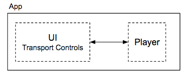
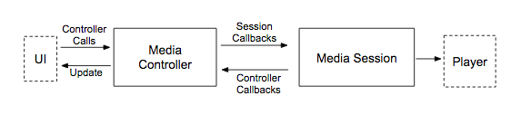

# Simple Music App

Educational Android app that implements a complete, fully-fledged architecture for a small music player using the Android Media APIs.

The music player is silent: it's just a thread that sleeps for the duration of the song entity it was instructed to play. This is because I want the focus to be on the app's architecture, which is explained in https://developer.android.com/guide/topics/media.

In fact, this app can be considered as an audio Hello World app. It's much simpler than the [Universal Audio Media Player app](https://github.com/android/uamp) because it doesn't use ExoPlayer and it strictly follows only what is described in the Android docs. No bells and whistles.

The following section are notes that I took while reading the Android docs.

## General concepts: Media app overview

These first sections talk about basic concepts that apply to all media apps. Media apps = both music apps and video apps.

A decent media app is separated into two components:

- A Player that renders the media (audio/video).
- A UI that issues commands to the player (play, pause, etc..) and displays the player's state.
  - Commands are represented as "Transport Controls" in the following diagram. 

<figure>
  
  <figcaption>Figure 1. Basic media app diagram</figcaption>
</figure>

A decent media app in Android completely separates and decouples these two parts. Why?
Because by doing so, the Player is not condemned to be used exclusively from the app's UI.
Instead, the Player can also be controlled from other places, such as:
- external hardware media buttons
- Google Assistant
- notification bar/lock screen

Android provides two universal classes used to decouple these two media app components. Since these
classes are universal, they allow a media app to integrate with any other Android app/component/mechanism
smoothly and consistently.

The two classes are: 1) an instance of `MediaController`, which controls the UI, and 2) an instance of `MediaSession`, which manages the player:

- The `MediaController`:
    - UI communicates exclusively with the `MediaController` (the UI never calls the player or the `MediaSession` directly).
    - Never calls the player directly: it calls the `MediaSession` instead.
    - Issues player commands to the `MediaSession`. Commands can be either:
        - Built-in, common commands, such as play, pause, stop, and seek.
        - Extensible custom commands, used to define special behaviors unique to your app.
    - Receives callbacks from the `MediaSession` informing about player state changes in order to update the UI.
        - These callbacks are also known as "Controller callbacks".
- The `MediaSession`:
    - Responsible for all communication with the player.
    - The player is only called from the `MediaSession`.
    - Receives command callbacks from the `MediaController`, and forwards these commands to the player.
        - Command callbacks are also known as "Session callbacks".
    - When the player updates its state, sends a controller callback to the `MediaController` notifying about this update.
 
<figure>
  
  <figcaption>Figure 2. Media app diagram with Android classes</figcaption>
</figure>

A `MediaController` can connect to only one `MediaSession` at a time, but a `MediaSession` can connect
with one or more `MediaController`s simultaneously. This allows your player to be
controlled from your app's UI as well as from other places (Google Assistant, notification bar, etc..).
Each of these "places" creates its own `MediaController` and connects to your app's `MediaSession` the same way.

## Player State

When the player state changes, the `MediaSession` notifies about this to all the `MediaController`s it is connected to. This means there must be some Android universal classes used to talk about player state.

And there are. Android provides two such classes:

- An instance of `PlaybackState`: The player's current operational state. Has fields for:
    - State: Playing/Paused/Buffering/Stopped/Error/etc..
    - Position (current progress as displayed in a seekbar)
    - Speed: How fast the media is being played (1x, 1.5x, 0.5x, etc..)
    - Valid controller actions (both built-in and custom) that can be handled in the current state.
        - These actions define what commands and external hardware media buttons the player will
          respond to in the current state.
    - Active error code and error message, if any. Errors can be fatal or non-fatal:
        -  **Fatal**: Happens when playback is interrupted and cannot resume.
            -  The state will be ERROR (instead of Playing, Paused, etc..)
            -  The error is cleared only when playback isn't blocked anymore
               (A new `PlaybackState` instance is generated, with a non-error state).
        - **Non-fatal**: Happens when the player cannot handle a request, but can continue to play.
            - Player remains in a non-error state (such as Playing or Paused).
            - This error is cleared in the next `PlaybackState` update (or overriden, if a new error comes in).
- An instance of `MediaMetadata`: information about what is currently playing. Has fields for:
    - Name of current artist, album, track
    - Duration of track
    - Album artwork
 
Whenever one of these two states change, the `MediaSession` informs the `MediaController`s
of this change by sending them one of two callbacks:

- `onPlaybackStateChanged()`
- `onMediaMetadataChanged()`

These controller callbacks receive as parameter the new `PlaybackState` or `MediaMetadata`. They are used to
update the UI according to the new state received.

## Design/Architecture of music apps

From this section onwards, we'll talk specifically about music apps
(no more talking about general media apps or video apps, unless explicitly mentioned).

An audio player does not always need to have its UI visible. Once it begins to play audio, 
the player can run as a background task. The user can switch to another app or
lock the device while continuing to listen.

To achieve this, the audio player must live within an Android service.
An Android service is a long-lived Android component that can run in the
background without needing a UI activity. The service's lifecycle is independent
of the activity's lifecycle. Your app's activity could have been
stopped (if you switched to another app) or destroyed (if you pressed the Back button
while on the activity), but your service may keep running.

---
Reminder: Lifecycle of a service

A service remains alive as long as it's *bound*, *started*, or both:
- **Bound**: One or several Android contexts (such as activities, other services, etc..) are bound/linked to the service. After being bound, these contexts are known as "clients".
- **Started**: The service is in the STARTED state.

When a service is created, it is initially created into one of these two states. You can't actually create a service directly. Instead, you do it indirectly by doing one of this:
- Bind a client to the service. The service will be created
  if it doesn't exist yet, and it will be bound to the client.
- Start the service. Again, the service is created if doesn't
  exist yet. Its initial state will be "Started".

A bound service can then be started, and a started service can then be bound to one or many clients. You can stop a started service, and you can unbind a client from a bound service as often as you wish. But once the service happens to be both unbound and stopped, it is immediately destroyed. 

IMAGEN diagram flowchart

---

Android offers two classes for implementing a client-service architecture in a music app: the `MediaBrowserService` and the `MediaBrowser`.
- The `MediaBrowserService` will own the player instance and its associated `MediaSession`.
  Why also the`MediaSession`? Because you probably want the player to be controlled from other places as well,
  even if your app's activity is destroyed. Otherwise, if the `MediaSession` lived within the activity,
  then it would be destroyed when the activity is destroyed.This would imply that your player could only be controlled from external places (e.g. Google Assistant)
when the activity was alive.

The service is created when it is started in response to a media button or when an activity binds to it (after connecting via its MediaBrowser)

A `MediaBrowserService` comes along with a `MediaBrowser`. 


This design is implemented with a client-server architecture:

- The server will be an Android service that will hold the player.
    - Implemented as a subclass of `MediaBrowserService`.
    - Will hold the `MediaSession` and the player.
- The client is an Activity for the UI.
    - Will hold a `MediaBrowser` that will connect to the `MediaBrowserService`.
    - Will also hold the `MediaController`.

<figure>
  
  <figcaption>Figure 3. Client-server architecture for music apps</figcaption>
</figure>

A `MediaBrowser` doesn't necessarily have to live in the same app/process as the `MediaBrowserService`. It will try to connect with a `MediaBrowserService`, and if the `MediaBrowserService` grants it permissions, the connection will be stablished.

**Question: why do we need to introduce yet another layer, the `MediaBrowser`-`MediaBrowserService` pair?
Doesn't the `MediaController`-`MediaSession` pair suffice?**

- The `MediaController`-`MediaSession` pair applies both to audio and video apps,
while the `MediaBrowser`-`MediaBrowserService` pair applies specifically to audio apps only.
  - The `MediaBrowser`-`MediaBrowserService` pair is used to implement to the client-server architecture we've just described, and video apps don't follow this architecture (only audio apps do).
  - The `MediaController`-`MediaSession` pair is not tied to any architecture so it can accomodate both music and video apps.
- We forcefully need an Android service so the music can play in the background. A `MediaSession` is not a service, hence we need `MediaBrowserService`.
  - And because we forcefully need `MediaBrowserService`, we also need its counterpart, the `MediaBrowser`. By itself, the `MediaController` is not enough: we need the `MediaBrowser` because it is the only entity capable of communicating with a `MediaBrowserServce`.

As mentioned in the previous section, having a well-defined `MediaController-MediaSession` separation allows your app's player (either an audio or video player) to be controlled not only from your app's UI, but also from other places. Now, for music apps, in addition to this advantage, having a well-defined `MediaBrowser`-`MediaBrowserService` architecture has two additional advantages:
- It makes your app discoverable to companion devices like Android Auto and Wear OS.
  - After discovering your app, the companion device can then take advantage of the `MediaController-MediaSession` separation, that is, it can proceed to create its own `MediaController`, connect to your `MediaSession`, and control playback, without accessing your app's UI activity at all.
  - Just like the `MediaController`-`MediaSession` pair, a `MediaBrowser` can only connect
    to a single `MediaBrowserService` at a time, but a `MediaBrowserService` can connect
    with multiple `MediaBrowser`s simultaneously.
- It also provides an optional browsing API that lets `MediaBrowser`s query the `MediaBrowserService` and build out a
  representation of its **content hierarchy**.
  - The content hierarchy is the media library offered by the app. It might consists of songs or recordings organized hierarchically into artists, albums, playlists, etc.
  - `MediaBrowser`s wanting to browse the content hierarchy must be granted browsing permission to do so. Browsing permissions are different from the connection permissions mentioned earlier.
  - We will see more about these topics in a subsequent section.

## Note: Use Compat classes (NOTE: Where should I place this paragraph?)

The recommended implementation of media sessions and media controllers are the classes
`MediaSessionCompat` and `MediaControllerCompat`. When you use these compat classes, you can remove
all calls to `registerMediaButtonReceiver()` and any methods from `RemoteControlClient`.

## How to setup a `MediaBrowserService` with a `MediaSession`?

1. Create a `MediaBrowserService` file.
2. Declare the `MediaBrowserService` with an intent-filter in the manifest:

   ```xml
   <service
     android:name=".SimpleMusicService"
     android:exported="false"> <!-- For simplicity, our service won't be called outside this app -->
     <intent-filter>
       <!-- Note that the name doesn't require the "Compat" suffix -->
       <action android:name="android.media.browse.MediaBrowserService" />
     </intent-filter>
   </service>
   ```

3. Create a new instance of `PlaybackState.Builder` and assign it to a final instance property of the service.
    - We will use this builder every time we need to update the player's playback state,
      instead of creating a new builder every time.
    - Since playback state updates happen quite frequently, caching the builder will greatly reduce memory
      consumption
5. Do the following in the service's `onCreate()` method:
    1. Instantiate a `MediaSession`.
    2. Assing an instance of `PlaybackState` to the `MediaSession`:
        - Use the builder created in step 3 and initialize it. 
            - A good way to initialize it is by defining some actions that you want the player to
              respond to in its initial state, such as `ACTION_PLAY` and `ACTION_PLAY_PAUSE`.
        - Build the builder and assign it to the `MediaSession`.
    3. Assign an instance of `MediaSession.Callback` to the `MediaSession`.
        - This instance contains the callbacks that forward to the player the commands issued from the `MediaController`.
        - Examples of callbacks: `onPlay()`, `onPause()`, `onSeekTo()`, `onSkipToNext()`
        - We'll see more about media session callbacks a bit later.
    5. Link the `MediaSession` to the `MediaBrowserService` by setting the media session token.
        - `MediaBrowser`s can then discover this session token when connecting to the `MediaBrowserService`.
        - `MediaController`s will then use the discovered token to communicate with the respective `MediaSession`.

This is how the `MediaBrowserService` looks up to now:

```java
public class SimpleMusicService extends MediaBrowserServiceCompat {
  private final PlaybackStateCompat.Builder playbackStateBuilder = new PlaybackStateCompat.Builder();
  private final MediaSessionCompat.Callback mediaSessionCallbacks = new MediaSessionCompat.Callback() {
    // Implement callbacks that react to commands issued from a MediaController,
    // most likely by forwading these commands to the player.
    // We'll see how to fill this out later.
  };

  private MediaSessionCompat mediaSession;

  @Override
  public void onCreate() {
    super.onCreate();

    // Create a MediaSession
    mediaSession = new MediaSessionCompat(this, SimpleMusicService.class.getSimpleName());

    // Set an initial PlaybackState with ACTION_PLAY and ACTION_PLAY_PAUSE
    // so these commands/media buttons can start the player
    mediaSession.setPlaybackState(playbackStateBuilder.setActions(
            PlaybackStateCompat.ACTION_PLAY |
                PlaybackStateCompat.ACTION_PLAY_PAUSE).build());

    // Set the media session callbacks
    mediaSession.setCallback(mediaSessionCallbacks);

    // Set the session's token so that MediaControllers can discover the session once the
    // MediaBrowsers connect to the service.
    setSessionToken(mediaSession.getSessionToken());
  }
}
```
    
## The Content hierarchy

Before proceeding, let's explain more about the `MediaBrowserService`'s content hierarchy mentioned earlier.
The **content hierarchy** is simply the media collection library offered by your app. `MediaBrowser`s connecting to your `MediaBrowserService` may be able to browse this collection so they know what songs/recordings can be played.

Technically speaking, the content hierarchy is a directed unweighted graph of nodes,
where each node represents a "media item". A media item can be different things,
depending if it's browsable and/or playable:

- If a media item is playable but not browsable, it represents a song, recording, etc..
- If a media item is browsable but not playable, it is a submenu/directory. Example: a playlist or album.
- Rare: If a media item is both playable and browsable, it is a submenu/directory, and it also has a song/recording associated to it.
- If a media items is neither playable nor browsable, it's useless. It's technically possible to create such media item, but I can't think of a use case for it.

You organize nodes/media items as you wish (for example, you may organize
songs into albums, playlists, artists, etc..). Each node has a unique ID, and it has between 0-N children.
This is an example of a very simple content hierarchy:

<figure>
  
  <figcaption>Figure 4. Sample content hierarchy</figcaption>
</figure>

This graph is merely conceptual and may not exist as such in the app. You don't have to create an actual graph data structure. However, your app should have a "mechanism" that, given a node ID, lets you know:
- The children of that node.
- If the node represents a playable media item, the media resource associated to that media item.

It's up to you what this "mechanism" will look like. It could be an actual graph, but it could also be a hashmap, an 2D array of adjacencies, etc.. Just meet the contract of the "mechanism".

The content hierarchy can be browsed by a `MediaBrowser` client that connected to your `MediaBrowserService` and that was given browsing permissions (you'll learn about permissions in the next section). You specify the starting node from which it will be allowed to browse, and you decide this in a client-per-client basis. So, for example, you could give `MediaBrowser` A permissions to access the full hierarchy, `MediaBrowser` B permissions to browse only alternative songs (starting from the *Alternative* node), and `MediaBrowser` C permissions
to browse only romantic songs (starting from the *Romantic* node).

Observe that the graph in the image is acyclic, meaning that it doesn't have any cycles.
This is important because it prevents infinite loops in the browsing algorithms of the
`MediaBrowser`s connecting to your service. You should ensure that your content hierarchy is acyclic as well.
Android won't validate this for you.

In the figure, you can see that several media items, such as *Viva la Vida*, have two parents.
This is completely valid, and it's a common characteristic of content hierarchies.
(And think about it: some songs can be considered belonging to two genres, such as *Viva la Vida* in this example).

Answer: No! You can have a graph like this:


.

However, when going through these uncommon use cases, as a best practice you should ensure
that all the starting point nodes from which you'll give clients permission to browse are
not playable (this isn't a requirement enforced by Android, but it's a best practice). 
I will explain the reason for this best practice in a following section.

So, for example, assuming we have Figure 6 as the content hierarchy, if you wanted to give a client
permissions to browse only pop songs, but also allow it to listen to the narrator introducing the
pop music section, then you will need to modify the content hierarchy to be like this:

<figure>
  
  <figcaption>
    Figure 7. Workaround to only allow clients to browse pop songs,
    but allowing them as way to hear the narrator introduction to the pop section.
  </figcaption>
</figure>

Then you will define the "Alternative starting point" as the starting node from which the client
will be allowed to browse. (There's nothing wrong with having several, "unreachable" starting points.
It's still a directed graph).

Again, we're doing this because we're following the best practice of making all starting points non-playable.
I will explain the reasoning for this best practice in a subsequent section.

**Question: What if I want to allow a client to browse the full graph except for one node? That is, what if I want to hide only one node to a client?**

Unfortunately, it's not possible to do this in a simple way. You cannot express node visibility permissions in terms
of "hiding" nodes, only in terms of selecting which nodes to show. You will need to create new parent nodes that point to the nodes you want the client to see.

For example, assuming we have Figure 6 as the content hierarchy, if you wanted to hide *Viva la Vida* to the client but let it browse the rest of the content hierarchy, you'll need to make the graph look like this:

## How to handle client connections to the `MediaBrowserService`?

Permissions to connect to the `MediaBrowserService` and to browse its content hierarchy are
controlled by the service's `onGetRoot()` method. As parameters, this
method receives the identifiers of the client wanting to connect and a `Bundle` of hints. You use these parameters
to define logic that determines whether to grant permissions to the client to reach the service, 
and if so, the subset of the content hierarchy the client should be allowed to browse.

The return type of this method is a `BrowserRoot`, which is an object that has an ID field.
For most cases, you return a `BrowserRoot` whose ID corresponds to the ID of the content hierarchy's node from
which you want to allow the client to browse. (And, as per the best practices stated above, this
node shouldn't be playable). However, there are two special cases:
- If you return `null`, it means the connection is refused and permission was not given.
- If you return a `BrowserRoot` whose ID does not match the ID of any node, it means that
  the client was granted permissions to connect, but it cannot browse the content hierarchy at all.
    - We call such `BrowserRoot` an empty `BrowserRoot` and its ID, an "empty media root id".

The `onGetRoot()` method should return quickly. User authentication and other slow processes should
not run in `onGetRoot()`, but in `onLoadChildren()`, which we explain next.

## How can a client build a representation of your app's content hierarchy?

If the value returned from `onGetRoot` is non-null, a client will now attempt to traverse the service's content hierarchy to build a UI representation of it. (A client will try to do this even if the `BrowserRoot` returned was the empty `BrowserRoot`, because the client doesn't have a way to know that).

This is the flow/algorithm that the client will follow. The algorithm is iterative:

1. The client calls the `MediaBrowserCompat.subscribe()` method, passing in the following as parameters:
    - The ID of the node whose children you want to obtain.
        - In the first iteration of the algorithm, this will be the ID of the `BrowserRoot` node returned from `onGetRoot`.
    - A callback that will be executed whenever the service returns the children of the requested node.
        - This callback has a `List<MediaItem>` as a parameter, which is precisely the result sent back by the service.
2. The `subscribe()` method internally ends up calling `onLoadChildren`, forwarding the node ID that it was passed in by the client.
3. `onLoadChildren` looks at the ID of the node passed in. It retrieves the immediate children of the node, and returns them as result.
    - If the ID of the passed-in node is actually the ID of the empty `BrowserRoot` node, then an empty list is returned.
    - Heavy processing, user authentication, and time-consuming business logic can run here. This method is async, meaning that it doesn't return
    with an actual `return`, but by calling `result.sendResult()` (`result` is the second parameter of `onLoadChildren`).
    - The children (instances of `MediaItem`) returned by this method should not contain icon bitmaps. Use a Uri instead by calling `setIconUri()` when you
     build the `MediaDescription` for each item.
4. The callback that was passed in in step 1 is executed on the client's side. This callback receives as parameter the list of children retrieved in the previous step.
    - The client uses this list to partially build (keep building) a menu of the content hierarchy.
5. The client looks at each `MediaItem` in the results.
    - If `MediaItem.isBrowsable()` is true, then the client jumps back to step 1, but now passing the ID of the current `MediaItem`.


The service is created when it is started in response to a media button or when an activity binds to it (after connecting via its MediaBrowser).

## Playback Resumption

Users can restart previous playback/media sessions from the music carousel (located near the Quick
Settings) without having to restart the app. When playback begins, the user interacts with the media
controls in the usual way.


In order to use this feature, you must enable Media resumption in the Developer Options settings.

After the device boots, the system looks for the five most recently used media apps, and provides
controls that can be used to restart playing from each app

The system attempts to contact your `MediaBrowserService` with a connection from SystemUI. Your app
must allow such connections, otherwise it cannot support playback resumption.

Connections from SystemUI can be identified and verified using the package
name `com.android.systemui` and signature. The SystemUI is signed with the platform signature.

In order to support playback resumption, your MediaBrowserService must implement these behaviors:

onGetRoot() must return a non-null root quickly. Other complex logic should be handled in
onLoadChildren()

When onLoadChildren() is called on the root media ID, the result must contain a FLAG_PLAYABLE child.

MediaBrowserService should return the most recently played media item when they receive an
EXTRA_RECENT query. The value returned should be an actual media item rather than generic function.

MediaBrowserService must provide an appropriate MediaDescription with a non-empty title and
subtitle. It should also set an icon URI or an icon bitmap.

The system retrieves the following information from the MediaSession's MediaMetadata, and displays
it when it is available:

METADATA_KEY_ALBUM_ART_URI METADATA_KEY_TITLE METADATA_KEY_ARTIST METADATA_KEY_DURATION (If the
duration isn’t set the seek bar doesn't show progress)

The media player shows the elapsed time for the currently playing media, along with a seek bar which
is mapped to the MediaSession PlaybackState.
