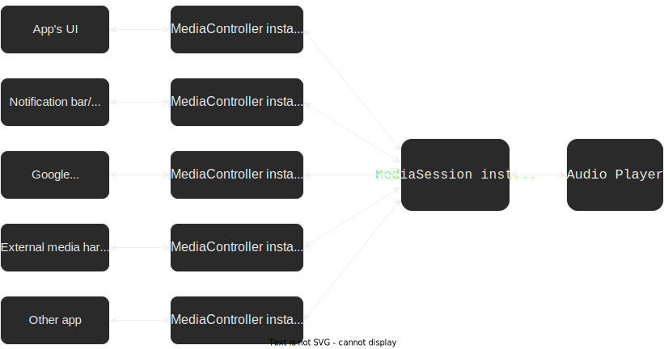

# Simple Music App

Educational Android app that demonstrates how to implement a complete, fully
fledged architecture for a small music player using the Android Media APIs.

The music player is silent: it's just a thread that sleeps for the duration of
the song entity it was instructed to play. This is because I want the focus to
be on the app's architecture.

This repository can be considered as a practical Android "Hello World" app for
music players. It's much simpler than the
[Universal Audio Media Player app](https://github.com/android/uamp) because it
doesn't use ExoPlayer and it strictly follows only what is described in the docs
(https://developer.android.com/guide/topics/media-apps/media-apps-overview). No
bells and whistles.

I am going to guide you, step by step, through the whole process of creating
this app from scratch. Every step is a commit in the repo's history. Please
follow along the commits in the history section of this repo as you read.

# Introduction

When thinking about implementing a music app, the most obvious component to
think of is the audio player. The **audio player** (or simply "player") is the
entity that's in charge of decoding/rendering/playing the audio media. A simple
audio player, for example, might have the ability to play audio files with
extensions `.wav` and `.mp3`.

However, in this documentation, we're not going to focus on implementing the
audio player. Instead, we're going to do two things:
  1. We're going to assume that the audio player entity is already implemented
     and it's callable through a certain reasonable API that it exposes.
  2. With this assumption in mind, we will focus on something more of a higher
     level: the music app's **architecture**, specifically for Android.

We don't need to know how the audio player is implemented to be able to define
and work on the architecture. We only need to have knowledge of its API so we're
able to call it. From the architecture's point of view, we only need to know how
to call the player's API so we can plug it in the right spots.

For the purposes of this documentation (which exclusively focuses on the music
app's architecture), we will assume that the player is already implemented and
exposes some reasonable API. This API might contain methods such as `play()`,
`pause()`, `skipToNext()`, and might also issue event callbacks such as
`onSongFinished()`. We will be fleshing out the details of the audio player's
API as we see fit throughout the course of this documentation.

# Spliting up the architecture

> Note before starting: some software development guides/tutorials normally
introduce code samples/snippets as they present concepts for you to follow along
and be working in your app's code as you read. Unfortunately, this isn't one of
those guides. The Android music app architecture is somewhat elaborate, and it's
difficult to even begin working on the app's code before having first a good
understading of all the elements the architecture consists of. So instead, I'll
first introduce these elements in an ordered, logical, and easy-to-follow way,
and once we have a full understanding of them, we can start working on the app's
implementation.

To understand the Android music app architecture, we first need to explicitly
list out the expectations that a decent Android music-playing app must fulfill:

  - **Expectation 1**: The app's music player should be controllable not only
    from the app's UI, but also from other places, such as:
      - the device's/peripherals' external hardware media buttons
      - the notification bar/lock screen (your app should provide a notification
        for the player)
      - Google Assistant
      - other devices/apps (see Expectation 2).
  - **Expectation 2**: The app's player should be discoverable to companion
    devices, such as Android Auto and Wear OS. Depending on your use case, your
    app's player might also need to be discoverable by other apps.
      - Once discovered, your app's player should be able to be controlled from
        the discoverer entities, as per Expectation 1.
      - Depending on your use case, you may also allow the discoverer entities to
        access your app's music library (songs, playlists, albums, artists,
        etc..).
  - **Expectation 3**: The app should keep playing in the background even if the
    user minimizes it, switches to another app, or locks the screen.
    
To meet these expectations, the Android music app architecture is split into two
parts:
  - The `MediaController`-`MediaSession` part: used to meet Expectation 1.
  - The `MediaBrowser`-`MediaBrowserService` part: used to meet Expectations 2
    and 3.

These two part are then combined together to form the complete music app
architecture. 
    
I'm going to explain these two parts. Once I'm done explaining them, the
Android music app architecture will fully make sense, and we will be able to
start working on our app's code.

# The `MediaController`-`MediaSession` part

This architectural part is used to fulfill Expectation 1, which I repeat here
below for convenience:

> The app's music player should be controllable not only from the app's UI,
> but also from other places, such as:
>  - the device's/peripherals' external hardware media buttons
>  - the notification bar/lock screen (your app should provide a notification
>    for the player)
>  - Google Assistant
>  - other devices/apps

For the sake of the explanation, let's give these "places" a name so we can
refer to them easily. These places are really player controlling mechanisms,
so let's call them "*contmechs*" (short for **cont**roller **mech**anisms).

> NOTE: The word "contmech" doesn't exist, either in the dictionary or in the
> Android docs. It's a word I just invented to make it easier to refer to the
> "places" listed in bullets in Expectation 1.

To fulfill Expectation 1, we need to abstract the player from the rest of the
app. That is, we need to separate the player into a decoupled, standalone
Android module that is callable from any of the contmechs listed above.

Hold on...didn't we do that already? Wasn't the initial assumption of this guide
that the player is already implemented and abstracted, and we just care about
its API?

Good question. To answer it, we need to clarify that there are two different
levels of abstractions:

  - The **behavioral-level abstraction**: This is the one we assumed it's
    already in place. This is simply abstracting out the player's promised
    behavior and functionality (i.e. its API) from the way it achieves that
    behavior and functionality (i.e, its implementation).
    - Something to observe here: this abstraction ideally should be
      **platform-independent**. That is, the player ideally should expose the
      same behavior and functionality no matter if we're in Android, iOS,
      Windows, Linux, etc..
    - However, the player's implementation can (and most likely will) be
      platform-dependent (the player will likely have to call into
      platform-specific frameworks and platform-specific APIs to get the audio
      media rendered, depending on the platform it lives in). We only care that
      the player's API is platform-independent.
    - Once you achieve this level of abstraction, your player will be callable
      as an independent entity from anywhere *within your app*, but not from
      outside it.
  - The **Android-level abstraction**: This is the abstraction that we're
    interested in this section. It's an Android-specific abstraction. We need
    to isolate the player in a Android-specific standalone media-player-module
    so that it's callable from the Android-specific contmechs, some of which
    live *outside* your app.
    - Since some contmechs live in different apps/processes than the player,
      the contmech-player communication might need to be handled externally by
      the OS, rather than by your app.
    - Thus, the OS needs to be able to identify your player as a standalone,
      callable media-player-module.
    - Thus, we need to abstract the player in such a way that it is identified
      as such by the OS.
    - Once we achieve this abstraction, the player will be callable from the
      contmechs, whether they're internal to your app or external to it.

You first achieve the behavioral-level abstraction, and then you work towards
achieving the Android-level abstraction.

> NOTE: Strictly speaking, it's technically possible to achieve the
> Android-level abstraction without the behavioral-level one. But that's a very
> bad practice, and I'm not going to explain that here.

To achieve the Android-level abstraction, Android provides us two classes:
  - An instance of `MediaController`, which encapsulates a single contmech.
  - an instance of `MediaSession`, which encapsulates the player.

Using these classes, the contmechs and the player are fully decoupled. Contmechs
sit behind their respective `MediaController`s, and the player sits behind the 
`MediaSession`. With the contmechs and player isolated, it's the
`MediaController`s and the `MediaSession` that communicate between them. The
following diagram outlines how communication flows (note that the double-pointed
arrows indicate bidirectional communication):

<figure>
  
  <figcaption>
    Figure 2. Media app diagram with Android classes
  </figcaption>
</figure>

Each entity (box) in the diagram above is only allowed to communicate with
the other entity(ies) it points to. There's no "bypassing" entities at all.

You'll need to wrap your player inside a `MediaSession`. Also, since your app's
UI is a contmech, you'll need to call the `MediaController` methods (and only
those methods) from it.
    
The `MediaController` and `MediaSession` classes are universal. This means that
any contmech encapsulated by a `MediaController` can bidirectionally connect
to any player encapsulated by a `MediaSession`. An author can create a
contmech and wrap it around a `MediaController`, and a completely different
author can create a player and wrap it around a `MediaSession`, and Android
guarantees that these two entities will be able to bidirectionally communicate
between them, without the authors having to know about each other's work.

Using the `MediaController` and `MediaSession` classes allows your player to 
mantain multiple connections to and receive commands from multiple contmechs
in the same user journey. For example, this user journey is possible:

  1. You issue a "play" command from your app's UI. This plays song "A".
  2. You pause the player through the player's notification bar. This pauses the
     same song "A" you started in step 1.
  3. You skip to the next song through the Google Assistant. This skips to song
     "B" (which follows song "A").
  4. You plug in your headphones to your device and press the "Pause" button on
     them. This pauses song "B".
     - It doesn't matter whether the exernal media device (in this case, the
       headphones) was previously plugged in or not. The player responds to the
       command as expected.
     - When the external media device is plugged in, Android automatically
       creates a media controller for it under the hood.

> NOTE: A `MediaSession` can connect to multiple `MediaController`s at a time.
> However, the inverse is not true: a `MediaController` can connect to only one
> `MediaSession` at a time.

Something to add: coloquially speaking, we often make these adjustments to our
language:
  - We often refer to a controller and its associated `MediaController`
    instance as simply "media controller".
  - We often simply use the term "media session" to refer to either:
      - the player and its associated `MediaSession` instance
      - or simply the `MediaSession` instance.

Since these are abstractions, we don't need to strictly distinguish a
controller from its associated `MediaController`, or a player from its
associated `MediaSession`. We just refer them as a whole by "media controller"
or "media session". 

From this point onwards, we will be adopting these colloquial ways of speech.

# The `MediaBrowser`-`MediaBrowserService` part

The `MediaController` and `MediaSession` classes make your player controllable
from various contmechs. This is very good, and you might feel that this is all
your app needs. But let's take a step back: how does a contmech find out about
the existence of your player in the first place? (Actually, a better worded
question would be: how do `MediaController`s find out about the existence of a
particular `MediaSession`?).

If a `MediaController` cannot locate a `MediaSession` to send commands to, then
it's basically useless. Fortunately, this is where the `MediaBrowser` and the
`MediaBrowserService` classes come into play. They make the `MediaSession`
*discoverable*, so it's reachable from other `MediaControllers`.

To be fair, some media controllers are able to discover your media session
without needing the `MediaBrowser` or `MediaBrowserService` classes (although
they might need other setup to be able to work... we will cover such setup later).
Such media controllers are:
  - Your app's UI: This is obvious, because the media session lives in your own
    same app. The media session is already "discovered".
  - Your player's notification: The notification's button listeners are defined
    in your app, and you can call the media session directly from them.
  - The Google Assistant
  - The external hardware media buttons

However, media controllers living in

  - other apps
  - Android Auto
  - Wear OS

cannot find your media session on their own. These media controllers need help
from the `MediaBrowser` and `MediaBrowserService` classes.

In addition, once a media controller discovers and connects to a media session,
then what? How does it know what songs/recordings/playlists are there available
for playback? A media controller can say, "Ok media session, please play song X",
but how does it even know that song X even exists?

There must be some functionality in place that lets a media controller browse the
content library offered by the media session. A media controller doesn't have such
browsing capabilities. Instead, these browsing capabilities are offered through the
`MediaBrowser` and `MediaBrowserService` classes (hence, their naming).

So even the media controllers that are able to discover your media session on
their own need the `MediaBrowser` and `MediaBrowserService` classes. Once they
discover and connect to the media session, they want to browse its content library
so they know what's possible to play.

Finally, your app should have the capacity to keep playing while it's in the
*background*. Once it begins to play audio, the player should run as a background
task, and the user should be able to switch to another app, minimize your app, or
even lock the device, and still continue to listen. In Android, the ability to
perform background work is done through **services**, and the `MediaBrowserService`
class is precisely a service used for music player apps to give them such background
playback feature.

So to summarize, the `MediaBrowser` and `MediaBrowserService` classes bring in
three pieces of crucial functionality to your app:
  - They make your player's media session *discoverable* to external
    media controllers.
  - They allow *browsing* your app's content library from outside your app's
    UI.
  - The `MediaBrowserService` allows your app to keep playing while its UI is
    in the background (not visible to the user).
    
In order to implement the `MediaBrowser`-`MediaBrowserService` pattern in your app,
these are the overall steps you have to take (don't worry, we'll dive into the
details later):
  1. Wrap your media controller (for example, your app's UI media controller)
     inside a `MediaBrowser`.
  2. Wrap your media session (which already wraps your player) inside a
     `MediaBrowserService`. 
  3. Set up your `MediaBrowserService` so it allows incoming connections from your
     `MediaBrowser` (and from other `MediaBrowser`s you wish to allow access to).
       - You can set connection permissions to your `MediaBrowserService` on a
         `MediaBrowser`-per-`MediaBrowser` basis. We'll see later how to do this.
       - For the `MediaBrowser`s that you did gave connection permissions to, you
         can define how much of the app's media library they will be able to
         browse. Again, we'll see the details of this later on.
  4. Connect your `MediaBrowser` to your `MediaBrowserService`.
  5. After connection succeeds, now make your media controller connect to your
     media session.
     
If you're observant, you might be asking this question: "But on Step 4, how will
the `MediaBrowser`s *themselves* discover the `MediaBrowserService`? We're back
to the initial problem!". The answer is that you just need to provide them with
the `MediaBrowserService`'s fully qualified class name. You also need to do some
additional setup (which we'll cover later), but for discoverability purposes, the
fully qualified class name is enough.

Once you follow these steps, your app will automatically get these three features
for free.

## Player State

When the player state changes, the `MediaSession` notifies about this to all the `MediaController`s it is connected to. This means there must be some Android universal classes used to talk about player state.

And there are. Android provides two such classes:

- An instance of `PlaybackState`: The player's current operational state. Has fields for:
    - State: Playing/Paused/Buffering/Stopped/Error/etc..
    - Position (current progress as displayed in a seekbar)
    - Speed: How fast the media is being played (1x, 1.5x, 0.5x, etc..)
    - Valid controller actions (both built-in and custom) that can be handled in the current state.
        - These actions define what commands and external hardware media buttons the player will
          respond to in the current state.
    - Active error code and error message, if any. Errors can be fatal or non-fatal:
        -  **Fatal**: Happens when playback is interrupted and cannot resume.
            -  The state will be ERROR (instead of Playing, Paused, etc..)
            -  The error is cleared only when playback isn't blocked anymore
               (A new `PlaybackState` instance is generated, with a non-error state).
        - **Non-fatal**: Happens when the player cannot handle a request, but can continue to play.
            - Player remains in a non-error state (such as Playing or Paused).
            - This error is cleared in the next `PlaybackState` update (or overriden, if a new error comes in).
- An instance of `MediaMetadata`: information about what is currently playing. Has fields for:
    - Name of current artist, album, track
    - Duration of track
    - Album artwork
 
Whenever one of these two states change, the `MediaSession` informs the `MediaController`s
of this change by sending them one of two callbacks:

- `onPlaybackStateChanged()`
- `onMediaMetadataChanged()`

These controller callbacks receive as parameter the new `PlaybackState` or `MediaMetadata`. They are used to
update the UI according to the new state received.

## Design/Architecture of music apps

From this section onwards, we'll talk specifically about music apps
(no more talking about general media apps or video apps, unless
explicitly mentioned).

To achieve this, the audio player must live within an Android service.
An Android service is a long-lived Android component that can run in the
background without needing a UI activity. The service's lifecycle is independent
of the activity's lifecycle. Your app's activity could have been
stopped (if you switched to another app) or destroyed (if you pressed the Back button
while on the activity), but your service may keep running.

Android offers a Service class precisely for music apps: the `MediaBrowserService`. This service will own:
- The player: This way, the player can continue living/playing even if your app's activity is destroyed.
- The `MediaSession` associated to the player. Why? Because you probably want the player to be controlled
  from other places as well, even if your app's activity is destroyed. Otherwise,
  if the `MediaSession` lived within the activity, then it would be destroyed when
  the activity is destroyed. This would imply that your player could only be controlled
  from external places (e.g. Google Assistant) when the activity was alive.

To make your activity bind to the `MediaBrowserService`, you need a `MediaBrowser` instance. In particular, you need to:
  - Make your activity own a `MediaBrowser` instance.
  - Make the `MediaBrowser` instance connect to the `MediaBrowserService`. 
  - From the `MediaBrowserService`, allow the incoming connection to establish.

When a `MediaBrowser` connects to the `MediaBrowserService`, it performs for you some internal boilerplate set-up for proper connection, and then binds the activity to the service.

<figure>
  
  <figcaption>Figure 3. Client-server architecture for music apps</figcaption>
</figure>

At this point, the service is bound, but not started yet. If your UI activity disconnects at this point, the service is destroyed. This isn't a problem because you haven't played any music yet. However, when playback starts, the user probably expects to continue listening even after switching apps. You don't want to destroy the player when you unbind the UI to work with another app.

For this reason, you need to ensure that the service is STARTED when it begins to play by calling `startService()`. A started service must be explicitly stopped, whether or not it's bound. This ensures that your player continues to perform even if the controlling UI activity unbinds.

A `MediaBrowser` doesn't necessarily have to live in the same app/process as the `MediaBrowserService`. It will try to connect with a `MediaBrowserService`, and if the `MediaBrowserService` grants it permissions, the connection will be stablished.

**Question: why do we need to introduce yet another layer, the `MediaBrowser`-`MediaBrowserService` pair?
Doesn't the `MediaController`-`MediaSession` pair suffice?**

- The `MediaController`-`MediaSession` pair applies both to audio and video apps,
while the `MediaBrowser`-`MediaBrowserService` pair applies specifically to audio apps only.
  - The `MediaBrowser`-`MediaBrowserService` pair is used to implement to the client-server architecture we've just described, and video apps don't follow this architecture (only audio apps do).
  - The `MediaController`-`MediaSession` pair is not tied to any architecture so it can accomodate both music and video apps.
- We forcefully need an Android service so the music can play in the background. A `MediaSession` is not a service, hence we need `MediaBrowserService`.
  - And because we forcefully need `MediaBrowserService`, we also need its counterpart, the `MediaBrowser`. By itself, the `MediaController` is not enough: we need the `MediaBrowser` because it is the only entity capable of communicating with a `MediaBrowserServce`.

As mentioned in the previous section, having a well-defined `MediaController-MediaSession` separation allows your app's player (either an audio or video player) to be controlled not only from your app's UI, but also from other places. Now, for music apps, in addition to this advantage, having a well-defined `MediaBrowser`-`MediaBrowserService` architecture has two additional advantages:
- It makes your app discoverable to companion devices like Android Auto and Wear OS.
  - After discovering your app, the companion device can then take advantage of the `MediaController-MediaSession` separation, that is, it can proceed to create its own `MediaController`, connect to your `MediaSession`, and control playback, without accessing your app's UI activity at all.
  - Just like the `MediaController`-`MediaSession` pair, a `MediaBrowser` can only connect
    to a single `MediaBrowserService` at a time, but a `MediaBrowserService` can connect
    with multiple `MediaBrowser`s simultaneously.
- It also provides an optional browsing API that lets `MediaBrowser`s query the `MediaBrowserService` and build out a
  representation of its **content hierarchy**.
  - The content hierarchy is the media library offered by the app. It might consists of songs or recordings organized hierarchically into artists, albums, playlists, etc.
  - `MediaBrowser`s wanting to browse the content hierarchy must be granted browsing permission to do so. Browsing permissions are different from the connection permissions mentioned earlier.
  - We will see more about these topics in a subsequent section.

## Note: Use Compat classes (NOTE: Where should I place this paragraph?)

The recommended implementation of media sessions and media controllers are the classes
`MediaSessionCompat` and `MediaControllerCompat`. When you use these compat classes, you can remove
all calls to `registerMediaButtonReceiver()` and any methods from `RemoteControlClient`.

## How to setup a `MediaBrowserService` with a `MediaSession`?

1. Create a `MediaBrowserService` file.
2. Declare the `MediaBrowserService` with an intent-filter in the manifest:

   ```xml
   <service
     android:name=".SimpleMusicService"
     android:exported="false"> <!-- For simplicity, our service won't be called outside this app -->
     <intent-filter>
       <!-- Note that the name doesn't require the "Compat" suffix -->
       <action android:name="android.media.browse.MediaBrowserService" />
     </intent-filter>
   </service>
   ```

3. Create a new instance of `PlaybackState.Builder` and assign it to a final instance property of the service.
    - We will use this builder every time we need to update the player's playback state,
      instead of creating a new builder every time.
    - Since playback state updates happen quite frequently, caching the builder will greatly reduce memory
      consumption
5. Do the following in the service's `onCreate()` method:
    1. Instantiate a `MediaSession`.
    2. Assing an instance of `PlaybackState` to the `MediaSession`:
        - Use the builder created in step 3 and initialize it. 
            - A good way to initialize it is by defining some actions that you want the player to
              respond to in its initial state, such as `ACTION_PLAY` and `ACTION_PLAY_PAUSE`.
        - Build the builder and assign it to the `MediaSession`.
    3. Assign an instance of `MediaSession.Callback` to the `MediaSession`.
        - This instance contains the callbacks that forward to the player the commands issued from the `MediaController`.
        - Examples of callbacks: `onPlay()`, `onPause()`, `onSeekTo()`, `onSkipToNext()`
        - We'll see more about media session callbacks a bit later.
    5. Link the `MediaSession` to the `MediaBrowserService` by setting the media session token.
        - `MediaBrowser`s can then discover this session token when connecting to the `MediaBrowserService`.
        - `MediaController`s will then use the discovered token to communicate with the respective `MediaSession`.

This is how the `MediaBrowserService` looks up to now:

```java
public class SimpleMusicService extends MediaBrowserServiceCompat {
  private final PlaybackStateCompat.Builder playbackStateBuilder = new PlaybackStateCompat.Builder();
  private final MediaSessionCompat.Callback mediaSessionCallbacks = new MediaSessionCompat.Callback() {
    // Implement callbacks that react to commands issued from a MediaController,
    // most likely by forwading these commands to the player.
    // We'll see how to fill this out later.
  };

  private MediaSessionCompat mediaSession;

  @Override
  public void onCreate() {
    super.onCreate();

    // Create a MediaSession
    mediaSession = new MediaSessionCompat(this, SimpleMusicService.class.getSimpleName());

    // Set an initial PlaybackState with ACTION_PLAY and ACTION_PLAY_PAUSE
    // so these commands/media buttons can start the player
    mediaSession.setPlaybackState(playbackStateBuilder.setActions(
            PlaybackStateCompat.ACTION_PLAY |
                PlaybackStateCompat.ACTION_PLAY_PAUSE).build());

    // Set the media session callbacks
    mediaSession.setCallback(mediaSessionCallbacks);

    // Set the session's token so that MediaControllers can discover the session once the
    // MediaBrowsers connect to the service.
    setSessionToken(mediaSession.getSessionToken());
  }
}
```
    
## The Content hierarchy

Before proceeding, let's explain more about the `MediaBrowserService`'s content hierarchy mentioned earlier.
The **content hierarchy** is simply the media collection library offered by your app. `MediaBrowser`s connecting to your `MediaBrowserService` may be able to browse this collection so they know what songs/recordings can be played.

Technically speaking, the content hierarchy is a directed unweighted graph of nodes,
where each node represents a "media item". A media item can be different things,
depending if it's browsable and/or playable:

- If a media item is playable but not browsable, it represents a song, recording, etc..
- If a media item is browsable but not playable, it is a submenu/directory. Example: a playlist or album.
- Rare: If a media item is both playable and browsable, it is a submenu/directory, and it also has a song/recording associated to it.
- If a media items is neither playable nor browsable, it's useless. It's technically possible to create such media item, but I can't think of a use case for it.

You organize nodes/media items as you wish (for example, you may organize
songs into albums, playlists, artists, etc..). Each node has a unique ID, and it has between 0-N children.
This is an example of a very simple content hierarchy:

<figure>
  
  <figcaption>Figure 4. Sample content hierarchy</figcaption>
</figure>

This graph is merely conceptual and may not exist as such in the app. You don't have to create an actual graph data structure. However, your app should have a "mechanism" that, given a node ID, lets you know:
- The children of that node.
- If the node represents a playable media item, the media resource associated to that media item.

It's up to you what this "mechanism" will look like. It could be an actual graph, but it could also be a hashmap, an 2D array of adjacencies, etc.. Just meet the contract of the "mechanism".

The content hierarchy can be browsed by a `MediaBrowser` client that connected to your `MediaBrowserService` and that was given browsing permissions (you'll learn about permissions in the next section). You specify the starting node from which it will be allowed to browse, and you decide this in a client-per-client basis. So, for example, you could give `MediaBrowser` A permissions to access the full hierarchy, `MediaBrowser` B permissions to browse only alternative songs (starting from the *Alternative* node), and `MediaBrowser` C permissions
to browse only romantic songs (starting from the *Romantic* node).

Observe that the graph in the image is acyclic, meaning that it doesn't have any cycles.
This is important because it prevents infinite loops in the browsing algorithms of the
`MediaBrowser`s connecting to your service. You should ensure that your content hierarchy is acyclic as well.
Android won't validate this for you.

In the figure, you can see that several media items, such as *Viva la Vida*, have two parents.
This is completely valid, and it's a common characteristic of content hierarchies.
(And think about it: some songs can be considered belonging to two genres, such as *Viva la Vida* in this example).

Answer: No! You can have a graph like this:


.

However, when going through these uncommon use cases, as a best practice you should ensure
that all the starting point nodes from which you'll give clients permission to browse are
not playable (this isn't a requirement enforced by Android, but it's a best practice). 
I will explain the reason for this best practice in a following section.

So, for example, assuming we have Figure 6 as the content hierarchy, if you wanted to give a client
permissions to browse only pop songs, but also allow it to listen to the narrator introducing the
pop music section, then you will need to modify the content hierarchy to be like this:

<figure>
  
  <figcaption>
    Figure 7. Workaround to only allow clients to browse pop songs,
    but allowing them as way to hear the narrator introduction to the pop section.
  </figcaption>
</figure>

Then you will define the "Alternative starting point" as the starting node from which the client
will be allowed to browse. (There's nothing wrong with having several, "unreachable" starting points.
It's still a directed graph).

Again, we're doing this because we're following the best practice of making all starting points non-playable.
I will explain the reasoning for this best practice in a subsequent section.

**Question: What if I want to allow a client to browse the full graph except for one node? That is, what if I want to hide only one node to a client?**

Unfortunately, it's not possible to do this in a simple way. You cannot express node visibility permissions in terms
of "hiding" nodes, only in terms of selecting which nodes to show. You will need to create new parent nodes that point to the nodes you want the client to see.

For example, assuming we have Figure 6 as the content hierarchy, if you wanted to hide *Viva la Vida* to the client but let it browse the rest of the content hierarchy, you'll need to make the graph look like this:

## How to handle client connections to the `MediaBrowserService`?

Permissions to connect to the `MediaBrowserService` and to browse its content hierarchy are
controlled by the service's `onGetRoot()` method. As parameters, this
method receives the identifiers of the client wanting to connect and a `Bundle` of hints. You use these parameters
to define logic that determines whether to grant permissions to the client to reach the service, 
and if so, the subset of the content hierarchy the client should be allowed to browse.

The return type of this method is a `BrowserRoot`, which is an object that has an ID field.
For most cases, you return a `BrowserRoot` whose ID corresponds to the ID of the content hierarchy's node from
which you want to allow the client to browse. (And, as per the best practices stated above, this
node shouldn't be playable). However, there are two special cases:
- If you return `null`, it means the connection is refused and permission was not given.
- If you return a `BrowserRoot` whose ID does not match the ID of any node, it means that
  the client was granted permissions to connect, but it cannot browse the content hierarchy at all.
    - We call such `BrowserRoot` an empty `BrowserRoot` and its ID, an "empty media root id".

The `onGetRoot()` method should return quickly. User authentication and other slow processes should
not run in `onGetRoot()`, but in `onLoadChildren()`, which we explain next.

## How can a client build a representation of your app's content hierarchy?

If the value returned from `onGetRoot` is non-null, a client will now attempt to traverse the service's content hierarchy to build a UI representation of it. (A client will try to do this even if the `BrowserRoot` returned was the empty `BrowserRoot`, because the client doesn't have a way to know that).

This is the flow/algorithm that the client will follow. The algorithm is iterative:

1. The client calls the `MediaBrowserCompat.subscribe()` method, passing in the following as parameters:
    - The ID of the node whose children you want to obtain.
        - In the first iteration of the algorithm, this will be the ID of the `BrowserRoot` node returned from `onGetRoot`.
    - A callback that will be executed whenever the service returns the children of the requested node.
        - This callback has a `List<MediaItem>` as a parameter, which is precisely the result sent back by the service.
2. The `subscribe()` method internally ends up calling `onLoadChildren`, forwarding the node ID that it was passed in by the client.
3. `onLoadChildren` looks at the ID of the node passed in. It retrieves the immediate children of the node, and returns them as result.
    - If the ID of the passed-in node is actually the ID of the empty `BrowserRoot` node, then an empty list is returned.
    - Heavy processing, user authentication, and time-consuming business logic can run here. This method is async, meaning that it doesn't return
    with an actual `return`, but by calling `result.sendResult()` (`result` is the second parameter of `onLoadChildren`).
    - The children (instances of `MediaItem`) returned by this method should not contain icon bitmaps. Use a Uri instead by calling `setIconUri()` when you
     build the `MediaDescription` for each item.
4. The callback that was passed in in step 1 is executed on the client's side. This callback receives as parameter the list of children retrieved in the previous step.
    - The client uses this list to partially build (keep building) a menu of the content hierarchy.
5. The client looks at each `MediaItem` in the results.
    - If `MediaItem.isBrowsable()` is true, then the client jumps back to step 1, but now passing the ID of the current `MediaItem`.


The service is created when it is started in response to a media button or when an activity binds to it (after connecting via its MediaBrowser).

## Playback Resumption

Users can restart previous playback/media sessions from the music carousel (located near the Quick
Settings) without having to restart the app. When playback begins, the user interacts with the media
controls in the usual way.


In order to use this feature, you must enable Media resumption in the Developer Options settings.

After the device boots, the system looks for the five most recently used media apps, and provides
controls that can be used to restart playing from each app

The system attempts to contact your `MediaBrowserService` with a connection from SystemUI. Your app
must allow such connections, otherwise it cannot support playback resumption.

Connections from SystemUI can be identified and verified using the package
name `com.android.systemui` and signature. The SystemUI is signed with the platform signature.

In order to support playback resumption, your MediaBrowserService must implement these behaviors:

onGetRoot() must return a non-null root quickly. Other complex logic should be handled in
onLoadChildren()

When onLoadChildren() is called on the root media ID, the result must contain a FLAG_PLAYABLE child.

MediaBrowserService should return the most recently played media item when they receive an
EXTRA_RECENT query. The value returned should be an actual media item rather than generic function.

MediaBrowserService must provide an appropriate MediaDescription with a non-empty title and
subtitle. It should also set an icon URI or an icon bitmap.

The system retrieves the following information from the MediaSession's MediaMetadata, and displays
it when it is available:

METADATA_KEY_ALBUM_ART_URI METADATA_KEY_TITLE METADATA_KEY_ARTIST METADATA_KEY_DURATION (If the
duration isn’t set the seek bar doesn't show progress)

The media player shows the elapsed time for the currently playing media, along with a seek bar which
is mapped to the MediaSession PlaybackState.
